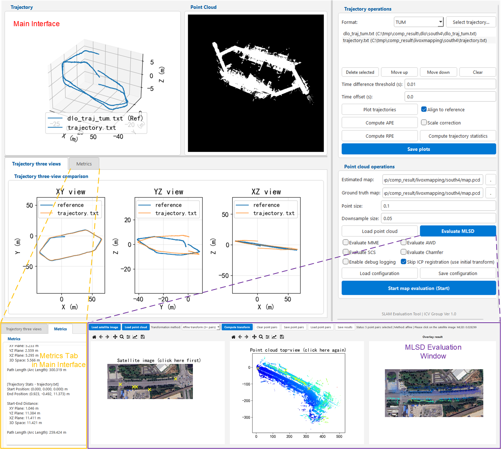
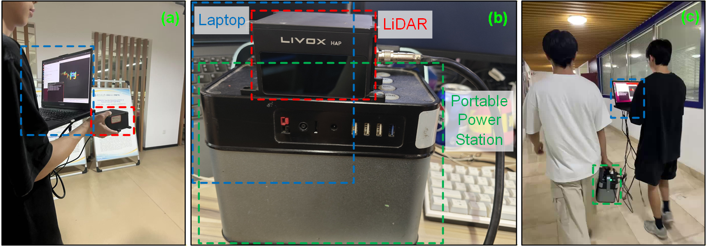
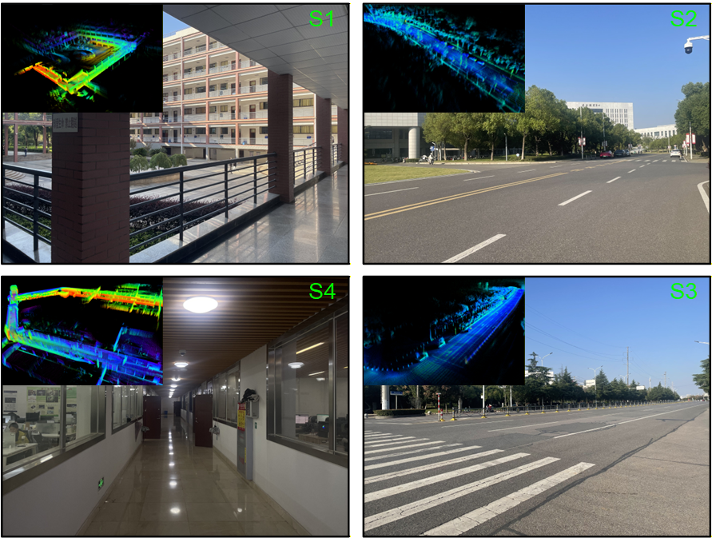

# SLAM-Eval：A Comprehensive Evaluation Tool for SLAM Trajectories and Point Cloud Maps



## Overview

This repository provides a **geometry-centric evaluation framework** for assessing **LiDAR SLAM map quality** when accurate ground-truth is unavailable or expensive to obtain. Instead of relying solely on trajectory metrics (e.g., ATE/RPE) or point-set distances (e.g., Chamfer/Hausdorff), we focus on diagnosing **global structural correctness** by measuring **non-rigid drift** such as spatial stretching/compression.

## Key Features

### Conventional Metrics Implementation

#### Trajectory

- **Absolute Pose Error (APE)**: Metric quantifying accumulated global pose deviation with respect to a reference trajectory
- **Relative Pose Error (RPE)**: Metric assessing short-term drift by comparing relative pose increments over fixed temporal or spatial intervals

#### Point Cloud Map

- **Chamfer Distance (CD)**: Bidirectional point cloud difference
- **Mean Map Entropy (MME)**: Information-theoretic local consistency metric
- **Average Wasserstein Distance (AWD)**: Robust global geometric accuracy assessment
- **Spatial Consistency Score (SCS)**: Enhanced local consistency evaluation

### Novel Proposed Metrics

- **Maximum Local Scale Deviation (MLSD)**: Scale-invariant metric for detecting spatially varying non-rigid distortion in BEV alignment.

## Datasets Details

The datasets were collected in both indoor and outdoor environments at Wuhan Textile University using a Livox HAP (TX) LiDAR sensor. The dataset can be downloaded [here](https://drive.google.com/file/d/1UlkYz0kKReFsDZU5adD7K9bRvTFB4xi6/view?usp=drive_link).






## Directory

```text
.
├── core/              # Core modules
│   ├── filters.py     # Trajectory filtering
│   ├── geometry.py    # Geometric operations
│   ├── lie_algebra.py # Lie algebra operations
│   ├── metrics.py     # Evaluation metrics (APE, RPE, etc.)
│   ├── result.py      # Result data structures
│   ├── sync.py        # Trajectory synchronization
│   ├── trajectory.py  # Trajectory handling
│   └── transformations.py  # Coordinate transformations
├── tools/             # Utility tools
│   ├── file_interface.py  # File I/O operations
│   ├── plot.py        # Plotting utilities
│   ├── pandas_bridge.py   # Pandas integration
│   └── ...
├── main_ape.py        # APE (Absolute Pose Error) entry point
├── main_rpe.py        # RPE (Relative Pose Error) entry point
├── main_traj.py       # Trajectory visualization entry point
├── map_evaluation.py  # Map quality evaluation
└── gui_interface.py   # GUI interface functions
│
├── gui/                   # GUI application
│   └── components/        # GUI components
│       ├── canvas.py      # Visualization canvases (trajectory, point cloud)
│       ├── panels.py      # Control panels
│       ├── tabs.py        # Tab widgets
│       ├── dialogs.py     # Dialog windows（MLSD）
│       └── models.py      # Data models
│
├── main.py                 # Main GUI window
└── requirements.txt        # Dependencies

```

## License

[GPL-3.0](https://www.gnu.org/licenses/gpl-3.0.html)

Our implementation is built upon the open-source framework [EVO](https://github.com/MichaelGrupp/evo) and is distributed under the GPL license.
